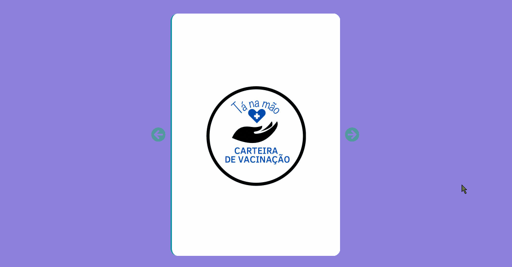

# Carteira de vacina digital

Esse projeto foi criado em um grupo de projeto integrador da Univesp, como parte das disciplinas de formação.

## Ferramentas

 

## Essa é uma pequena amostra do projeto

